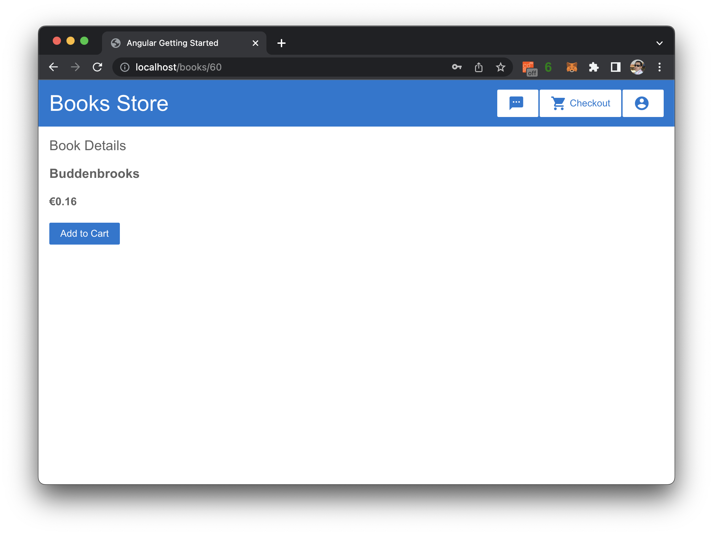

# X-Store
---

***Note: ***
- `docker` service and `docker compose` plugin or `docker desktop` with docker compose is required
- This project is a demonstration project. Therefore, I am attaching temporary credentials or sensitive information for convenience.
- Safari browser or iOS/iPad device not supported, This project use `metamask` wallet for demo and safari not supported this plugin
- I use `binance-testnet` network as testnet for Bookstore wallet
- Pls, use add **Smart Chain - Testnet**
  - URL RPC URL:  https://data-seed-prebsc-1-s1.binance.org:8545/
  - Explorer URL:  https://testnet.bscscan.com
  - Chain ID: 97
  - Symbol:  BNB
- by default, This project run on `80` and `443` ports
  - Can change these port in `x-proxy/http.d/default.conf` config file

## Step to run project

- `git clone https://gitlab.com/token-x/x-compose.git`
- `cd x-compose`
- `docker compose up -d`
  - this command will pull all images automatically
- open Chrome browser and then navigate to `http://localhost` or `https://localhost`
- you can stop all service and remove all container by run command `docker compose down` in repo folder

## etc

